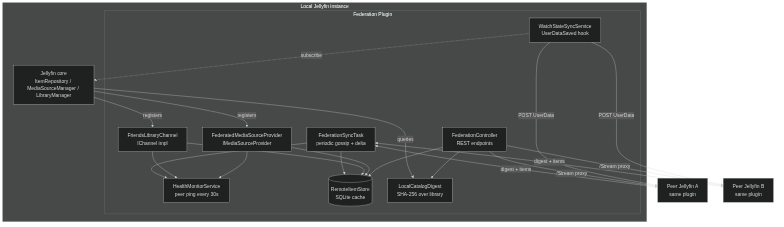

# Jellymesh

Federate multiple Jellyfin servers into a unified library. Share, dedupe,
expose multi-version playback, watch-sync, issue anonymous share links,
and delegate key issuance between trusted peers - all from one Jellyfin
install.

## Status

Pre-1.0 release candidate. Feature-complete, 5 code-review passes,
127 tests passing, CI green. Not yet validated against a live multi-peer
federation in the wild; the wire protocol may still tweak.
See [CHANGELOG](CHANGELOG.md) for shipped detail.

## Target

- Jellyfin 10.10+ (ABI `10.10.0.0`)
- .NET 8.0

## What it does

```
┌─────────────── My Jellyfin ────────────────┐    ┌─── Alice's Jellyfin ───┐
│                                            │    │                        │
│  My local library                          │    │  Alice's library       │
│  ┌──────────────────────────┐              │    │  ┌──────────────────┐  │
│  │  + federated rows:       │  gossip      │◀──▶│  │ Federation       │  │
│  │  • peer 4K versions      │  digest      │    │  │ plugin (peer)    │  │
│  │  • Alice's films I lack  │              │    │  └──────────────────┘  │
│  │  • Bob's anime           │  watch-sync  │    │                        │
│  └──────────────────────────┘              │    └────────────────────────┘
│                                            │
│  Public anon-share URLs                    │    ┌─── Bob's Jellyfin ─────┐
│  → /Federation/Public/{token}              │◀──▶│  …                     │
└────────────────────────────────────────────┘    └────────────────────────┘
```

- **Dedup matching** by TMDB / IMDB / TVDB id with title+year fallback.
  Same film on multiple peers = one item with multiple `MediaSource`
  entries (Jellyfin's built-in version picker handles the UI).
- **Friends Library** virtual channel (`IChannel`) surfaces items peers
  have that you don't, deduped against your local TMDB ids.
- **Stream reverse-proxy** keeps the peer's API token server-side and
  exposes a local `/Federation/Stream/...` URL with optional bandwidth
  cap (`ThrottledStream`).
- **Gossip sync** - periodic digest exchange skips full pull when peer
  hash unchanged; push-based invalidation (`PushInvalidationService`)
  notifies peers on local add/remove (debounced).
- **Deletion detection** - diff of cached vs fetched id-set per round.
- **Health monitor** - 30 s ping, signature-keyed cache invalidation
  hides offline-peer items from UI immediately.
- **Watch-state federation** - push (on `UserDataSaved`) + pull (per
  sync round, merge into a configured local user). Loop-break via
  `UserDataSaveReason.Import`.
- **Per-library share keys** - issue a random key per friend × library
  set; revocable. Schedule windows (IANA-TZ, cross-midnight) + content
  filters (blocked tags + max parental rating with strict-unknown mode).
- **Anonymous share links** - per-video URLs, optional expiry +
  use-cap. `PublicShareStore.TryConsume` is a single atomic SQL
  statement (UPDATE…WHERE…RETURNING) under WAL + busy_timeout, so
  concurrent callers respect the cap exactly.
- **Federated search** - fan-out across peers with per-peer 10 s
  timeout, results tagged with origin.
- **Stats dashboard** - peers online/enabled/total, TMDB-only dedup
  ratio, total streams + bytes, per-peer table, top-streamed items,
  polls every 30 s from config page.
- **Audit log** - every served byte recorded per peer / item / user.
- **Admin endpoints require `Policies.RequiresElevation`** - regular
  users can't mint share URLs, list peer keys, or trigger sync.

See [docs/architecture.md](docs/architecture.md),
[docs/protocol.md](docs/protocol.md), and
[docs/sync-flow.md](docs/sync-flow.md) for wire detail.

## Quick install

```sh
git clone https://github.com/vozec/JellyfinFederation
cd JellyfinFederation
bash build/package.sh
unzip build/output/Federation_*.zip -d <jellyfin-config>/plugins/
sudo systemctl restart jellyfin
```

Then Dashboard → Plugins → Federation:
1. Add a peer (URL + Jellyfin API key for stream reverse-proxy +
   optional FederationShareKey for catalog access).
2. Issue a share key to give your friend, scoped to the libraries +
   hours + ratings you want them to see.
3. (Optional) Set `PublicBaseUrl` to enable push-invalidation.

## Architecture



## Build & test

```sh
# build the plugin DLL (Release)
dotnet build src/Jellyfin.Plugin.Federation/Jellyfin.Plugin.Federation.csproj -c Release

# package as drop-in zip
bash build/package.sh

# run unit tests (60 currently)
bash build/test.sh
```

The test wrapper picks up a user-local .NET 8 runtime (`~/.dotnet`) if
the host only ships .NET 10 (Arch / CachyOS case). On Ubuntu / Debian
with ASP.NET 8 system-wide, just `dotnet test` works. CI runs against
.NET 8.

## API surface

Admin (requires elevation):
```
GET    /Federation/Peers/Status
GET    /Federation/Stats
GET    /Federation/Diagnostics              (live self-test against each peer)
GET    /Federation/Audit/Recent?limit=N
GET    /Federation/Catalog/Digest
GET    /Federation/Catalog/Items
POST   /Federation/Sync/Trigger
GET    /Federation/Shares
POST   /Federation/Shares                  (returns key once)
DELETE /Federation/Shares/{id}
GET    /Federation/PublicShares
POST   /Federation/PublicShares            (per-video link)
DELETE /Federation/PublicShares/{token}
```

User (authenticated):
```
GET    /Federation/Search?searchTerm=X&limit=N
GET    /Federation/Stream/{server}/{item}?sourceId=X
GET    /Federation/Image/{server}/{item}/{type}
```

Peer / anonymous (token-auth):
```
GET    /Federation/Share/Catalog/Digest    (X-Federation-Share header)
GET    /Federation/Share/Catalog/Items     (X-Federation-Share header)
POST   /Federation/Invalidate              (X-Federation-Share header)
GET    /Federation/Public/{token}          (HTML viewer)
GET    /Federation/Public/{token}/Stream   (raw + Range support)
```

## Roadmap

Shipped (see [CHANGELOG](CHANGELOG.md) for detail):

- M1–M4: scaffold, sync, dedup, stream proxy
- M5: remote-only Friends Library (`IChannel`)
- M6: watch state sync (push + pull, loop-broken via `Import` reason)
- M7: federated search
- Bandwidth cap (`ThrottledStream`) + per-stream audit log
- Gossip digest with deletion detection (anti-spam pull)
- Push-based catalog invalidation (debounced)
- Peer health monitor with signature-keyed UI invalidation
- Per-library share keys with schedule windows + content filters
- Anonymous video share links (expiring + use-capped, atomic SQL)
- Federation stats dashboard panel
- Mermaid-rendered docs + GitHub Actions CI

Backlog:

- [ ] Conflict-aware metadata merge (canonical poster/description per
      matched TMDB across peers)
- [ ] Request system ("ask peer to add this") with optional *arr push
- [ ] Push retry / backoff on transient failure
- [ ] Trakt / AniList cross-instance scrobble aggregation
- [ ] Subtitle + audio track federation (pull peer's tracks for items
      we have locally)
- [ ] Source fallback chain when one peer's high-quality version stalls
- [ ] Mesh topology (peer-of-peer transitive sharing)

## License

GPL-2.0 (Jellyfin-compatible).
