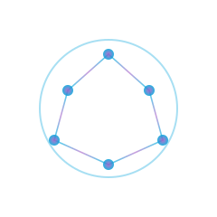

<div align="center">

<!-- Drop a logo at docs/logo.svg to render it here -->


# Jellymesh

**Federate multiple Jellyfin servers into one library.**

Dedupe by TMDB. Stream a friend's 4K copy as a version of your local film.
Sync watch state both ways. Share single videos by anonymous link.
Introduce peers to peers without forwarding files.

[Install](#install) · [Quick start](#quick-start) · [Architecture](docs/architecture.md) · [Protocol](docs/protocol.md) · [Introductions](docs/introductions.md)

</div>

---

## What it does

```
my Jellyfin                       Alice's Jellyfin
┌─────────────────────┐           ┌─────────────────────┐
│ + federated rows:   │  gossip   │                     │
│   Alice's 4K films  │◄─────────►│ + my films appear   │
│   Bob's anime       │           │   in her library    │
│ + watch state sync  │           │                     │
└─────────────────────┘           └─────────────────────┘
        ▲     ▲                              ▲
        │     │                              │
        │     └────── push invalidation ─────┘
        │
        └── anon share link ──> friend's browser
```

The plugin runs inside Jellyfin, mounts as a Channel ("Friends Library"),
adds peer sources to your local items via `IMediaSourceProvider`, and
exposes a REST surface for catalog gossip, watch-state push/pull,
public viewer pages, and delegated key issuance.

## Features

| | |
|--:|---|
| **Catalog sync** | gossip digest, deletion detection, delta-only pulls |
| **Push invalidation** | local add/remove debounced for 30 s, retried 5× with backoff |
| **Dedup matching** | TMDB, IMDB, TVDB, title+year fallback |
| **Multi-version playback** | same film on multiple peers shows as picker entries |
| **Stream proxy** | peer's `X-Emby-Token` stays server-side, bandwidth cap, audit log |
| **HTTP Basic auth** | peers behind a reverse-proxy that wants Basic still federate |
| **Watch state** | push on `UserDataSaved`, pull on each sync, merge with loop break |
| **Federated search** | fan out across peers, results tagged with origin |
| **Per-library share keys** | scope by libraries, hours, blocked tags, rating cap |
| **Anonymous share links** | per-video, expiring, use-capped, atomic SQL consume |
| **Subtitle federation** | discover and proxy peer subtitle tracks for items you have locally |
| **Introductions** | B asks A to mint a key for C, with hop cap, dedup, cascade revoke |
| **Diagnostics** | one click runs probes against every peer, prints a report |
| **Dashboard** | online peers, cache, dedup ratio, top streams, bytes served |

## Install

```sh
git clone git@github.com:Vozec/Jellymesh.git
cd Jellymesh
bash build/package.sh
unzip build/output/Federation_*.zip -d <jellyfin-config>/plugins/
sudo systemctl restart jellyfin
```

Then in Jellyfin: Dashboard → Plugins → Federation.

## Quick start

1. **Add a peer.** Paste their Jellyfin URL, your user-level API key on their server (for stream proxying), and the federation share key they handed you (for catalog access). HTTP Basic credentials are optional, fill in if the peer is behind one.

2. **Issue a key for a friend.** Pick which libraries to share, the hours it's allowed (server local TZ or IANA id), tag and rating filters, optional binding to a peer URL. Hand them the resulting key.

3. **Set your public base URL** (top of the config). Used by push invalidation and introduction-forward delivery.

## Build & test

```sh
dotnet build src/Jellyfin.Plugin.Federation/Jellyfin.Plugin.Federation.csproj -c Release
bash build/test.sh
```

CI runs the same on every push: build, test with coverage, format check, package the plugin zip, render diagrams.

## License

GPL-2.0 (Jellyfin-compatible).
