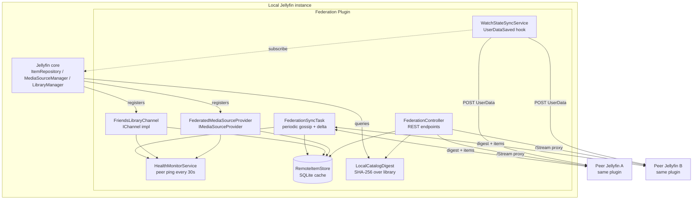

# Architecture

## High-level

## Key components

| Component | Responsibility |
|-----------|----------------|
| `FederationSyncTask` | Periodic gossip handshake → conditional delta pull → deletion detection |
| `HealthMonitorService` | 30 s ping rotation, raises `HealthChanged` on flip |
| `PeerHealthRegistry` | In-memory state + signature hash for cache invalidation |
| `LocalCatalogDigest` | Computes SHA-256 over local items, optionally scoped to a library set |
| `RemoteItemStore` | SQLite cache: `remote_items`, `peer_digests`, `stream_audit` |
| `FederatedMediaSourceProvider` | Injects peer sources into matched local items (TMDB/IMDB id lookup) |
| `FriendsLibraryChannel` | `IChannel` surfacing peer-only items in a virtual library row |
| `WatchStateSyncService` | Pushes local progress/played to peers on `UserDataSaved` |
| `FederationController` | REST: stream proxy, search, audit, digest, items, shares |
| `ThrottledStream` | Read-side bandwidth cap on outbound proxied streams |

See also: [protocol.md](./protocol.md) for wire format, [sync-flow.md](./sync-flow.md) for sequence.
