# Architecture

## High-level

```mermaid
graph TB
    subgraph LOCAL[Local Jellyfin instance]
        direction TB
        JF_CORE[Jellyfin core<br/>LibraryManager / MediaSourceManager /<br/>UserDataManager / ITaskManager]

        subgraph PLUGIN[Federation Plugin]
            direction TB

            subgraph SVC[Services]
                SYNC[FederationSyncTask<br/>periodic gossip + delta pull]
                HEALTH[HealthMonitorService<br/>peer ping every 30s]
                PUSH[PushInvalidationService<br/>debounced add/remove<br/>with retry backoff]
                WATCH[WatchStateSyncService<br/>UserDataSaved hook → push]
                DIGEST[LocalCatalogDigest<br/>SHA-256 + content filter]
                STATS[FederationStatsService<br/>per-peer + global aggregates]
            end

            subgraph STORES[SQLite stores - WAL]
                S_REMOTE[(RemoteItemStore<br/>remote_items, peer_digests,<br/>stream_audit)]
                S_PUBLIC[(PublicShareStore<br/>public_shares)]
                S_REQ[(RequestStore<br/>federation_requests)]
            end

            subgraph SURFACE[Jellyfin surface]
                CHANNEL[FriendsLibraryChannel<br/>IChannel: peer-only items]
                MSP[FederatedMediaSourceProvider<br/>IMediaSourceProvider:<br/>dedup-matched peer sources]
            end

            subgraph API[FederationController endpoints]
                A_STREAM["Stream + Image<br/>reverse-proxy"]
                A_ADMIN["Stats / Audit<br/>Shares / PublicShares<br/>Requests / Sync-Trigger<br/>(requires elevation)"]
                A_PEER["Share-Catalog-Digest<br/>Share-Catalog-Items<br/>Invalidate / Request<br/>(X-Federation-Share auth)"]
                A_PUBLIC["Public viewer<br/>+ Public stream<br/>(anonymous)"]
            end

            subgraph SEC[Auth helpers]
                PEER_URL[PeerUrl<br/>canonical scheme://host:port]
                SCHED[ScheduleWindow<br/>cross-midnight HH:mm]
                CFILTER[ContentFilter<br/>tag+rating mapping]
                RETRY[RetrySchedule<br/>30/60/120/240/480s backoff]
            end
        end

        JF_CORE --> CHANNEL
        JF_CORE --> MSP
        JF_CORE -. UserDataSaved .-> WATCH
        JF_CORE -. ItemAdded/Removed .-> PUSH
        JF_CORE -.-> DIGEST

        SYNC --> S_REMOTE
        SYNC --> HEALTH
        SYNC --> JF_CORE
        CHANNEL --> S_REMOTE
        CHANNEL --> HEALTH
        MSP --> S_REMOTE
        MSP --> HEALTH
        STATS --> S_REMOTE
        STATS --> HEALTH

        A_ADMIN --> S_REMOTE
        A_ADMIN --> S_PUBLIC
        A_ADMIN --> S_REQ
        A_ADMIN --> STATS
        A_PEER --> DIGEST
        A_PEER --> S_REMOTE
        A_PEER --> S_REQ
        A_PUBLIC --> S_PUBLIC
        A_STREAM --> S_REMOTE

        A_PEER -.-> PEER_URL
        A_PEER -.-> SCHED
        DIGEST -.-> CFILTER
        PUSH -.-> RETRY
    end

    PEER1[Peer Jellyfin A<br/>same plugin]
    PEER2[Peer Jellyfin B<br/>same plugin]

    SYNC <-- gossip digest + items --> PEER1
    SYNC <-- gossip digest + items --> PEER2
    PUSH -- invalidate on change --> PEER1
    PUSH -- invalidate on change --> PEER2
    A_STREAM -- proxy --> PEER1
    A_STREAM -- proxy --> PEER2
    WATCH -- POST UserData --> PEER1
    WATCH -- POST UserData --> PEER2
```

## Components

### Background services (IHostedService / IScheduledTask)

| Component | Schedule | Responsibility |
|-----------|----------|----------------|
| `FederationSyncTask` | every `SyncIntervalMinutes` | Gossip digest handshake → conditional delta pull → deletion detection → pull watch state |
| `HealthMonitorService` | every 30 s | Ping each peer, update `PeerHealthRegistry`, raise `HealthChanged` on flip |
| `PushInvalidationService` | every 5 s (tick) | Debounce ItemAdded/Removed; push invalidation; retry with exponential backoff |
| `WatchStateSyncService` | event-driven | Subscribe `UserDataSaved`, push to peers (skip when reason=Import) |

### Stateless services

| Component | Purpose |
|-----------|---------|
| `LocalCatalogDigest` | Compute SHA-256 digest of local items; produce filtered catalog list |
| `FederationStatsService` | Aggregate per-peer + global stats from stores + health registry |
| `RemoteJellyfinClient` | All outbound HTTP to peers; auth header injection; pagination |

### Pure helpers (tested static)

| Component | What it decides |
|-----------|-----------------|
| `PeerUrl.Canonicalize` / `SameHost` | URL drift normalization (scheme/host/port) |
| `ScheduleWindow.IsWithin` | HH:mm window check, cross-midnight |
| `ContentFilter.Passes` | Blocked-tag + max-rating gate with strict-unknown mode |
| `RetrySchedule.NextDelay` | Exponential backoff: 30/60/120/240/480s, max 5 |

### Stores (SQLite, WAL, busy_timeout 10s)

| Store | Tables |
|-------|--------|
| `RemoteItemStore` | `remote_items`, `peer_digests`, `stream_audit` |
| `PublicShareStore` | `public_shares` (atomic TryConsume via UPDATE…RETURNING) |
| `RequestStore` | `federation_requests` (uniq partial index on pending dedup) |

### Jellyfin surface

| Type | Role |
|------|------|
| `FriendsLibraryChannel : IChannel` | Surface peer-only items as a virtual library row |
| `FederatedMediaSourceProvider : IMediaSourceProvider` | Inject peer sources on dedup-matched local items |

### REST surface (`FederationController`)

| Scope | Endpoints |
|-------|-----------|
| Admin (requires elevation) | `/Stats` `/Audit/Recent` `/Shares` `/PublicShares` `/Requests/{in\|out}` `/SendRequest` `/Sync/Trigger` `/Catalog/Digest` `/Catalog/Items` `/Peers/Status` |
| User (authenticated) | `/Search` `/Stream/{server}/{item}` `/Image/{server}/{item}/{type}` |
| Peer (X-Federation-Share) | `/Share/Catalog/Digest` `/Share/Catalog/Items` `/Invalidate` `/Request` |
| Anonymous | `/Public/{token}` `/Public/{token}/Stream` |

See [protocol.md](./protocol.md) for the wire format and [sync-flow.md](./sync-flow.md) for the gossip + push sequences.
