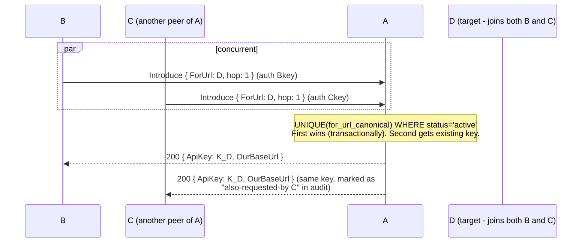
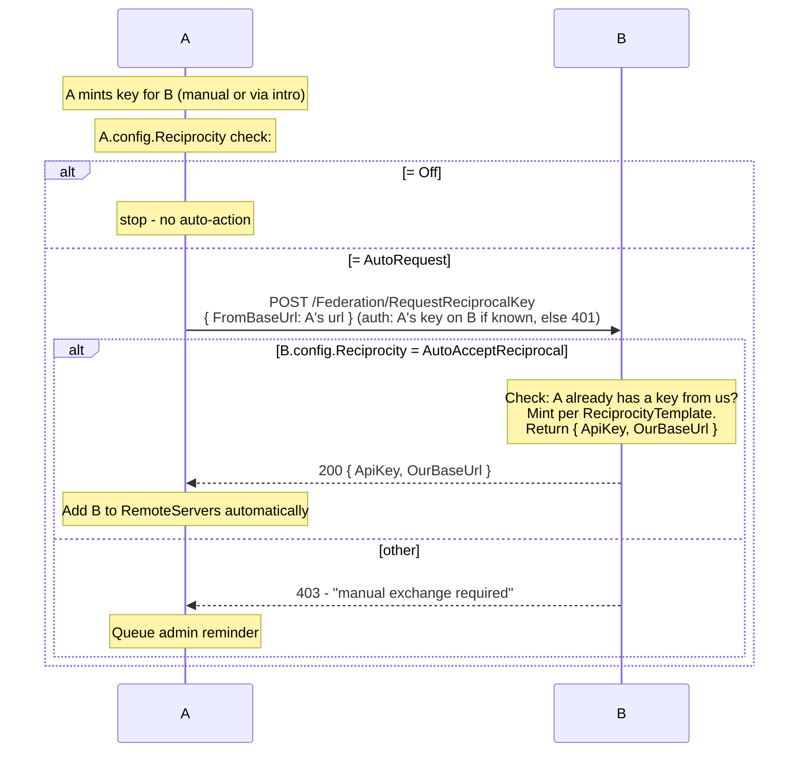

# Introductions - delegated key issuance

> **Status:** v0.10 spec. See [protocol.md](./protocol.md) for endpoint signatures.

A node lets a trusted peer (the *introducer*) request a new federation
share key on behalf of a third party. Trust is opt-in at every hop and
loops are blocked by canonical-URL dedup.

## Roles

| Role | Description |
|------|-------------|
| **Introducer** | The middleman. Holds a share key on the *issuer* with `CanRequestIntroductions=true`. |
| **Issuer** | The node that mints the new key. Receives `POST /Federation/Introduce`. |
| **Receiver** | The third party the new key is for. Receives `POST /Federation/Introduced` (or admin pastes manually). |

When B introduces C to A: **A = issuer, B = introducer, C = receiver**.

## Trust model - three per-key knobs

Per-key (`ShareKey`):

| Field | Semantic | Default |
|-------|----------|---------|
| `CanRequestIntroductions: bool` | "This key may call `/Federation/Introduce` on me" | `false` |
| `MintMode: { Reject, Request, AutoAccept }` | What to do when this key requests a mint | `Request` |

Per-node (`PluginConfiguration`):

| Field | Semantic | Default |
|-------|----------|---------|
| `Reciprocity: { Off, AutoRequest, AutoAcceptReciprocal }` | When *we* mint for X, do we ask X for a key back? Or when X asks us for a key back, do we auto-accept? | `Off` |
| `ReciprocityTemplate: ShareKeyTemplate` | Scope of auto-accepted reciprocal keys | all libs, no filter |
| `IntroductionHopCap: int?` | Reject when hop_count exceeds | `null` (no cap) |
| `IntroductionRatePerHour: int` | Per-introducer-key throttle | 5 |
| `IntroductionRatePerDay: int` | Per-introducer-key throttle | 50 |

## Scope inheritance

When A mints a key for C at B's request, the new key inherits B's scope
(LibraryIds, BlockedTags, MaxOfficialRating, schedule, etc.). Admin
adjusts post-mint via the standard share-key UI.

Rationale: B can only introduce within their own access. Avoids
accidentally over-sharing - if B can see Movies+Series on A but not
Adult, the key B mints for C can't either.

Exception: `CanRequestIntroductions` does NOT propagate. Introduced
keys default to `false` so chains require explicit admin opt-in at
each hop.

## Dedup - concurrent introductions for the same `for_url`



Implementation: SQLite `introductions` table with partial unique index
on `for_url_canonical WHERE status='active' AND our_role='issuer'`.
Second `INSERT … ON CONFLICT DO NOTHING RETURNING id` returns null →
the controller looks up the existing row to return its `issued_key_id`.

Both introducers are recorded (audit table joins on the active key id).

## Loop prevention (defense-in-depth)

1. **Self-exclusion** - `ForUrl == config.PublicBaseUrl` canonical → 400
2. **Already-peer** - `ForUrl ∈ config.RemoteServers.BaseUrl` canonical → 409 (idempotent)
3. **Dedup** - see above
4. **Per-introducer rate limit** - 5/h, 50/d default, configurable
5. **Hop cap** - payload includes `hop_count`; receiver rejects if > cap

(1)+(2)+(3) make cycles structurally impossible: A→B→C→A would already
have A as a peer of C at the time C tries to introduce A back to A.

## Reciprocity flow



`AutoAcceptReciprocal` requires the requester to ALREADY have a key
from us (proves prior trust relationship). Without that, we'd be
open to "give me a free key" spam from any anonymous caller.

## Cascade revoke

When admin removes `CanRequestIntroductions` from a key, all
introductions minted via that key are listed with a checkbox:

```
B's key 'Movies → Alice' has issued 3 introduction-keys:
  ├─ alice.example (key 4a3b…)
  ├─ bob.example (key 9c2d…)
  └─ carol.example (key 7e1f…)

  [ ] Also revoke these 3 keys
  [✓] Keep them, just disable new introductions
  [Cancel]  [Apply]
```

Default = keep. Computed from `introductions.introducer_key_id`.

## Probe before forward

Before B calls C's `/Federation/Introduced`, B does:
```
GET https://c/Federation/Catalog/Digest (no auth - checking liveness)
```
- 401 → plugin present, key would be wrong - still safe to forward
- 404 / network err → C doesn't run the plugin. Surface to admin:
  *"Couldn't deliver to C. Hand them this manually: URL + key."*

## Endpoint summary

| Method | Path | Auth | Purpose |
|--------|------|------|---------|
| POST | `/Federation/Introduce` | `X-Federation-Share` (introducer's key) | B asks A to mint for C |
| POST | `/Federation/Introduced` | `X-Federation-Share` (sender's key on receiver) | B forwards minted key to C |
| POST | `/Federation/RequestReciprocalKey` | `X-Federation-Share` (caller's key on us) | A asks B to mint a reciprocal |
| POST | `/Federation/IntroducePeer` | RequiresElevation | Admin triggers full flow on B |
| GET | `/Federation/Introductions/{in\|out}` | RequiresElevation | Audit log |
| POST | `/Federation/Introductions/{id}/Approve` | RequiresElevation | Admin approves pending intro |
| POST | `/Federation/Introductions/{id}/Revoke` | RequiresElevation | Admin revokes (with cascade option) |

## Audit storage

```sql
CREATE TABLE introductions (
    id INTEGER PRIMARY KEY AUTOINCREMENT,
    our_role TEXT NOT NULL,         -- 'issuer' | 'forwarder' | 'receiver'
    introducer_key_id TEXT,          -- which ShareKey was used by the introducer
    for_url_canonical TEXT NOT NULL, -- the receiver's URL, canonical
    issued_key_id TEXT,              -- which ShareKey we minted (for issuer role)
    hop_count INTEGER NOT NULL DEFAULT 1,
    status TEXT NOT NULL DEFAULT 'pending', -- pending|active|rejected|revoked|expired
    created_utc TEXT NOT NULL,
    completed_utc TEXT,
    note TEXT
);
CREATE UNIQUE INDEX uniq_active_intro
    ON introductions(our_role, for_url_canonical)
    WHERE status = 'active';
```

## Backward compatibility

Every field added is optional and defaults to legacy behavior:
- `CanRequestIntroductions=false` → existing keys can't introduce
- `MintMode=Request` → introductions queue for admin approval
- `Reciprocity=Off` → no auto-action when minting
- `IntroductionHopCap=null` → no cap
- Existing installs see no behavior change until admin enables.
