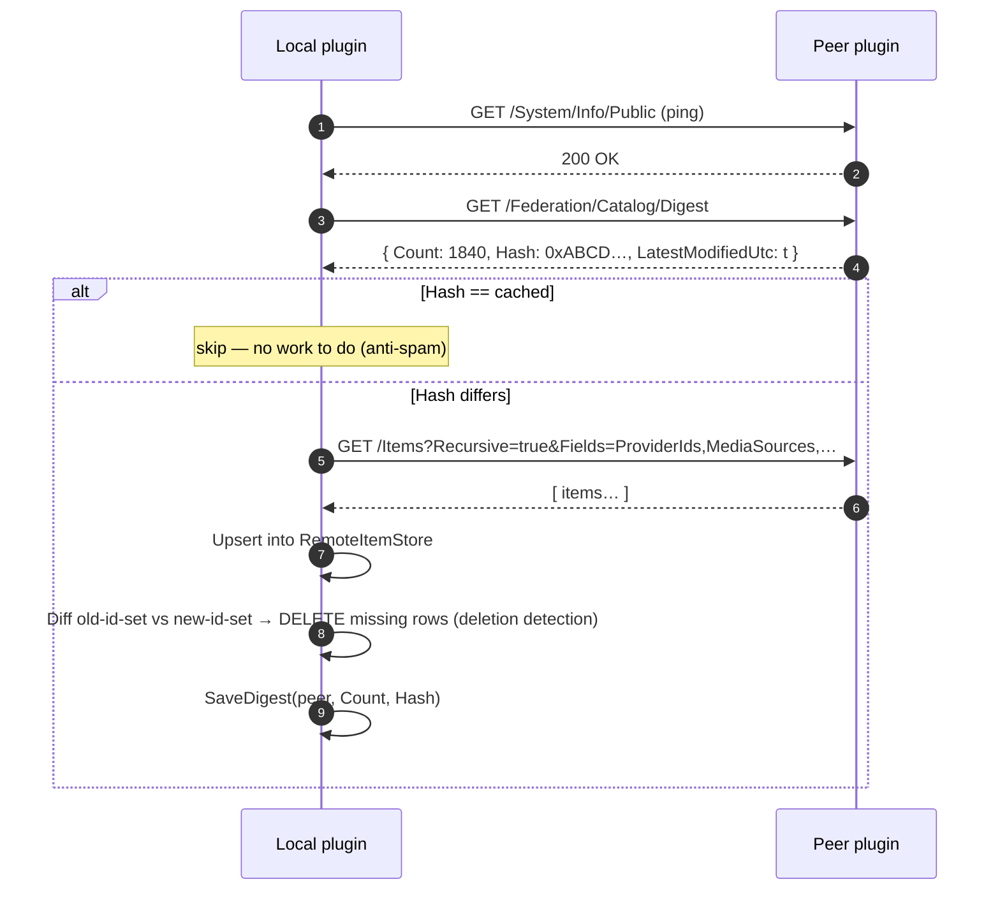
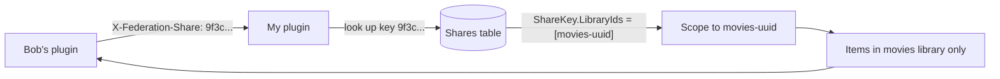
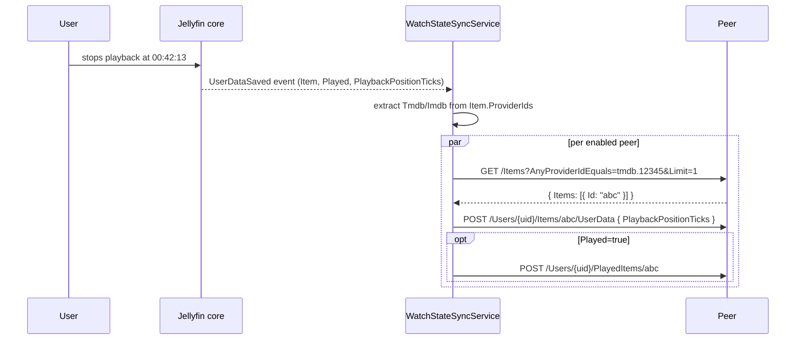

# Protocol

## Endpoints exposed by the plugin

All under `/Federation/` on a normal Jellyfin instance, requiring the
standard `X-Emby-Token` for admin/user endpoints. Share endpoints accept
an `X-Federation-Share` header instead.

### Peer-facing (called by other federated nodes)

| Method | Path | Auth | Body / Response |
|--------|------|------|------------------|
| GET | `/Federation/Catalog/Digest` | `X-Emby-Token` | `{ Count, Hash, LatestModifiedUtc }` |
| GET | `/Federation/Catalog/Items` | `X-Emby-Token` | `[{ Id, Name, Type, ModifiedUtc }]` |
| GET | `/Federation/Share/Catalog/Digest` | `X-Federation-Share` | same shape, **scoped to share's libraries** |
| GET | `/Federation/Share/Catalog/Items` | `X-Federation-Share` | same shape, scoped |
| GET | `/Federation/Stream/{serverId}/{itemId}?sourceId=X` | user | proxied HLS/MP4 stream |

### Admin (requires elevation)

| Method | Path | Purpose |
|--------|------|---------|
| GET | `/Federation/Peers/Status` | per-peer `{ Online, LastRttMs, LastCheckUtc }` |
| GET | `/Federation/Stats` | per-peer + global aggregates (items, dedup ratio, streams, bytes) |
| GET | `/Federation/Diagnostics` | live self-test against each peer: URL parse, key set, ping, digest, auth, pull-sync wiring |
| GET | `/Federation/Search?searchTerm=X&limit=N` | fan-out search across all peers |
| GET | `/Federation/Audit/Recent?limit=N` | recent stream-serve log |
| POST | `/Federation/Sync/Trigger` | run the sync scheduled task now |
| GET | `/Federation/Shares` | list issued share keys (preview) |
| POST | `/Federation/Shares` | issue a new share key (returns the key once) |
| DELETE | `/Federation/Shares/{id}` | revoke share key |
| GET | `/Federation/PublicShares` | list per-video anon links + status |
| POST | `/Federation/PublicShares` | mint a public link (`{ItemId, ExpiresUtc?, MaxUses?}`) |
| DELETE | `/Federation/PublicShares/{token}` | revoke a public link |
| GET | `/Federation/Requests/{in\|out}?status=...` | list peer-to-peer requests |
| POST | `/Federation/SendRequest` | ask a peer to add an item |
| POST | `/Federation/Requests/{id}/Status?status=...` | accept / decline / dismiss / send-failed |

### Anonymous (public viewer)

| Method | Path | Purpose |
|--------|------|---------|
| GET | `/Federation/Public/{token}` | minimal HTML `<video>` viewer; consumes 1 use |
| GET | `/Federation/Public/{token}/Stream` | raw file with Range support (validates only) |

## Gossip-based sync

Pseudo-protocol for one sync round (per peer):



## Catalog digest

The digest is reproducible across nodes:

```
sorted_pairs = sort_by_id([(item.Id.N, item.DateLastSaved.Ticks) for item in (Movie|Series|Episode)])
serialized   = "\n".join(f"{id}:{ticks}" for id, ticks in sorted_pairs)
hash         = SHA256(serialized).hex()
```

The hash flips on any add, remove, or metadata change anywhere in the
covered libraries. Two peers running the plugin against an identical
library would produce the same digest — though that's never the actual
comparison; the comparison is "peer's digest now" vs "what I cached last
round from this peer".

## Share-key access scoping



A share key:
- is opaque (32 random bytes, hex-encoded)
- maps to a list of Jellyfin library (TopParent) ids; empty = all
- is revocable via DELETE; immediate effect
- never appears as `X-Emby-Token` on Bob's side — Bob's plugin sends it
  only on `/Federation/Share/*` calls

## Watch state push



Push direction only for now. Pull (peer state → local) deferred — would
piggyback on the same gossip round.

## Stream proxy

When a user picks a remote source in the UI, the player hits
`/Federation/Stream/{serverId}/{itemId}?sourceId=X`. The plugin:

1. Looks up peer config by `serverId`.
2. Rewrites the request to `<peer>/Videos/{itemId}/stream?static=true&MediaSourceId=X`.
3. Adds `X-Emby-Token: <peer.ApiKey>`.
4. Forwards `Range` header for seek support.
5. Pipes response bytes back, optionally throttled (`ThrottledStream`).
6. Logs (`peer_id, item_id, bytes_served, started_utc, ended_utc`) to
   `stream_audit`.

The client never learns the peer URL or token — both stay server-side.
