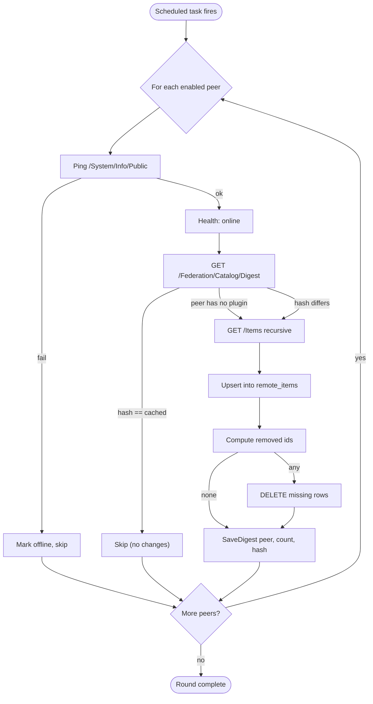
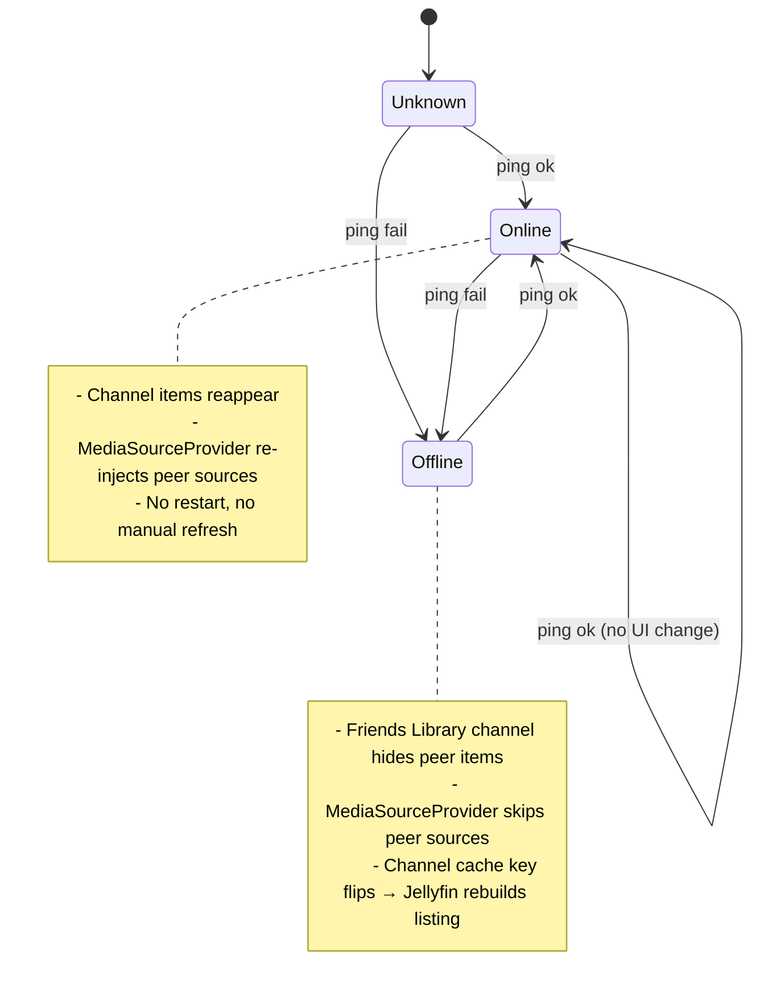
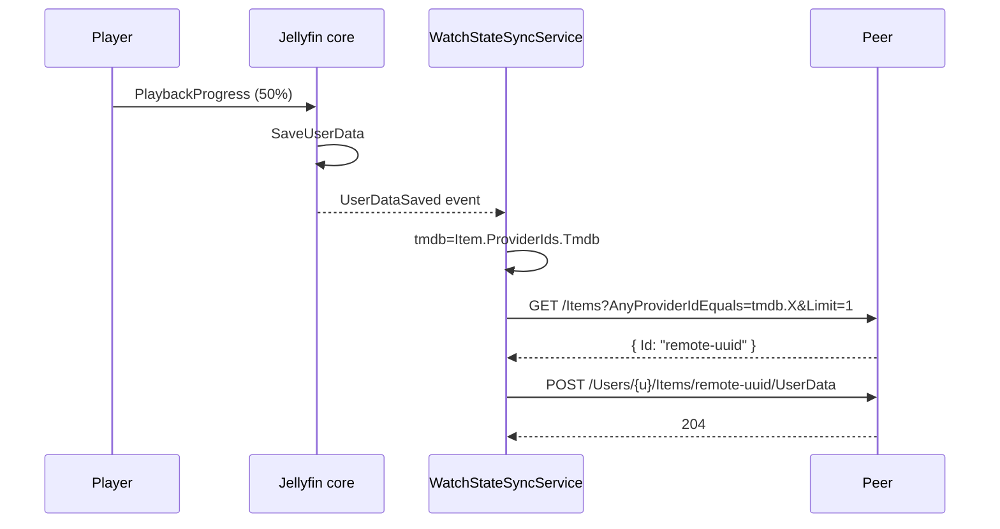
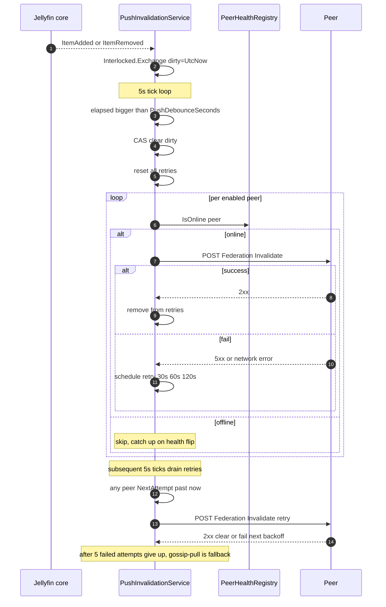

# Sync flow

## Full sync round

```mermaid
flowchart TD
    Start(["Scheduled task fires"]) --> Loop{"For each enabled peer"}
    Loop --> Ping["Ping /System/Info/Public"]
    Ping -->|fail| Skip["Mark offline, skip"] --> NextPeer{"More peers?"}
    Ping -->|ok| MarkOnline["Health: online"]
    MarkOnline --> Digest["GET /Federation/Catalog/Digest"]
    Digest -->|peer has no plugin| Pull["GET /Items recursive"]
    Digest -->|"hash == cached"| SkipNoChange["Skip (no changes)"] --> NextPeer
    Digest -->|hash differs| Pull
    Pull --> Upsert["Upsert into remote_items"]
    Upsert --> Diff["Compute removed ids"]
    Diff -->|any| Delete["DELETE missing rows"]
    Diff -->|none| SaveDigest["SaveDigest peer, count, hash"]
    Delete --> SaveDigest
    SaveDigest --> NextPeer
    NextPeer -->|yes| Loop
    NextPeer -->|no| Done(["Round complete"])
```

## Health-state effect on UI

```mermaid
stateDiagram-v2
    [*] --> Unknown
    Unknown --> Online: ping ok
    Unknown --> Offline: ping fail
    Online --> Offline: ping fail
    Offline --> Online: ping ok
    Online --> Online: ping ok (no UI change)

    note right of Offline
        - Friends Library channel hides peer items
        - MediaSourceProvider skips peer sources
        - Channel cache key flips → Jellyfin rebuilds listing
    end note

    note right of Online
        - Channel items reappear
        - MediaSourceProvider re-injects peer sources
        - No restart, no manual refresh
    end note
```

## Watch state flow

```mermaid
sequenceDiagram
    participant Player
    participant JFCore as Jellyfin core
    participant WSS as WatchStateSyncService
    participant Peer

    Player->>JFCore: PlaybackProgress (50%)
    JFCore->>JFCore: SaveUserData
    JFCore-->>WSS: UserDataSaved event
    WSS->>WSS: tmdb=Item.ProviderIds.Tmdb
    WSS->>Peer: GET /Items?AnyProviderIdEquals=tmdb.X&Limit=1
    Peer-->>WSS: { Id: "remote-uuid" }
    WSS->>Peer: POST /Users/{u}/Items/remote-uuid/UserData
    Peer-->>WSS: 204
```

## Push-invalidation with retry

```mermaid
sequenceDiagram
    autonumber
    participant JF as Jellyfin core
    participant PIS as PushInvalidationService
    participant H as PeerHealthRegistry
    participant P as Peer

    JF-->>PIS: ItemAdded or ItemRemoved
    PIS->>PIS: Interlocked.Exchange dirty=UtcNow
    Note over PIS: 5s tick loop

    PIS->>PIS: elapsed bigger than PushDebounceSeconds
    PIS->>PIS: CAS clear dirty
    PIS->>PIS: reset all retries
    loop per enabled peer
        PIS->>H: IsOnline peer
        alt online
            PIS->>P: POST Federation Invalidate
            alt success
                P-->>PIS: 2xx
                PIS->>PIS: remove from retries
            else fail
                P-->>PIS: 5xx or network error
                PIS->>PIS: schedule retry 30s 60s 120s
            end
        else offline
            Note over PIS: skip, catch up on health flip
        end
    end

    Note over PIS: subsequent 5s ticks drain retries
    PIS->>PIS: any peer NextAttempt past now
    PIS->>P: POST Federation Invalidate retry
    P-->>PIS: 2xx clear or fail next backoff

    Note over PIS: after 5 failed attempts give up, gossip-pull is fallback
```

